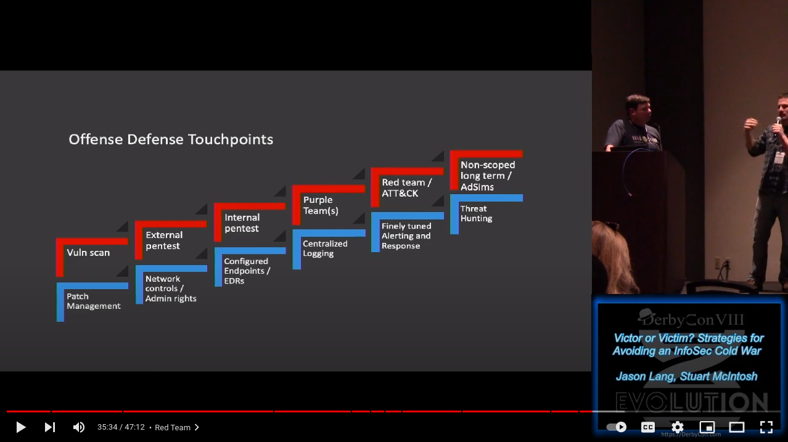
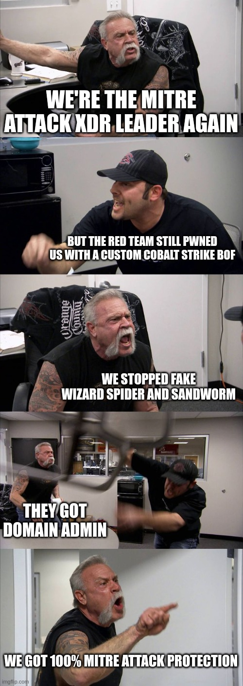

La page d'accueil est dans `prez_finale.md`

---

# README

Fichier de travail à Dany.

---

# Bio: Dany Lafrenière   V0.01

- SOC Manager :necktie:	
- Master at agenda Tetris :jigsaw::date::jigsaw:
- Tierless SOC strong believer
- In love with a cat lover :cat::cat::cat:
- Used to like this but not sure anymore:
  - IPA :beer:
  - Eating birthday cake :cake:
  - Presenting at HF with a Red Teamer :red_circle:

---

# OUTLINE + MAJ

---

<!-- _footer: "https://www.youtube.com/watch?v=9_cZ5xn-huc" -->

# Inspiration for this talk

  

<!--

Notes:
  - Expliquer le talk. Chaque marche offensive a son penchant défensif
  - 1 étape à la fois. Pour apprécier la marche suivante, 
  - Les 3 premières marches: Paradigme de prévention
  - Les 3 dernières marches: Paradigme de détection (Purple)
  - On peut imaginer une 7ième marche: La simulations d'adversaires

-->

---

# Purple vs Red

## Purple Team Exercises

- People, **Techno**, Process
- Goal: Improve security posture
- Require: Collaboration (with blue)
- Analogy: The study

## Red Team Exercises

- **People**, Techno, **Process**
- Goal: Resilience testing
- Require: Surprise :boom:
- Analogy: The exam

---

# Purple vs Blue

---

# Blue vs Purple testing

<!--
- High level to introduce concepts
-->

- Analytic Testing Tools
  - Great to quick start testing and automation
  - Many open source options
  - Can be hard to maintain ...

<!--  

Notes danlaf:
  - This section needs more research vs BAS
  - Example of these tools
    - **Automated:**
      - Atomic Red Team (Red Canary)
      - RTA by Endgame
    - **Manual more like testing tools:**
      - Metasploits
      - Cobalt Strike

-->

- Breach and Attack Simulation (BAS)
  - Feeds from up-to-date intel and TTPs 
  - Great to automatically test if the controls or detection are working... or still working
  - Can be used to automate repeatable purple team tests

<!--  

Notes danlaf:
  - Keep the test up to date versus "known" IOCs and TTPs
  - Can definitely be used to assist in purple teaming
  - Ability to safely test against malware
  - can remove in part the challenge and limitation of a report/snapshot only "point in time"
  
-->

- Purple Teaming
  - Great to emulate TTPs and Map the defence posture
  - Need a mature Blue Team
  - Great opportunities for SOC analyst training

<!--  

Notes danlaf:
- need coordination and collaboration with Red and Bleu
- Maximized by mixing more junior SOC Analyst with more experience 
  - A great way to see what suspicious activities look like in the environment vs 99.999% of the time looking at false positive
- Time and resources must be freed up

-->

---

<!-- _paginate: false -->

# Challenges with current landscape

Limitations with typical testing

- The neverending challenge of priorization
- Most testing reports are snapshots
- Post-activities are contextual to the selected scope
- Reports require unnecessary time to write and consume
- Cannot feed a security posture (easily)

  

<!--

Notes mdube:

- Difficile de prioriser. Se baser sur CTI?

-->

---

# Challenges with the current landscape

The reports from the Blue team manager's point of view ... TL;DR
 
- Results are hard to consume 
- Recommendations are easy
- Multiples goals and priorities with finite resources
  - ...the never-ending operational backlog and incident response 
  
<!--  -->

<!--  

Notes danlaf:

- Results are hard to consume
  - Can be very long, too detailed ... I mean please put the findings to fix in a summary at the beginning! 
- Recommendation is easy
  - Often seems that everything is classified Critical or High ... without effort estimates.
  - Does not take into consideration the chain of attack e.i. vs criticality of what is not prevented/detected.
- Multiples goals and priorities with finite resources
  - Hoorey! more backlog on the backlog pile ... !
  -  I’m only the blue… Who said that when the fun is over I am the only one doing the dishes ... we need the Yellow.
- Resources (people) are never enough... the RedTeam must balance the impact ex: an Internal Redteam exercise will impact the availability of the Blue for the Purple activities

-->

---

<!-- _class: separation_page3 -->

# Introducing Continuous Purple Teaming

---

# People: Manage your ego

- The Foundational Importance Of Trust In Relationships
  - Consistency
  - Communication
  - Admit mistakes
  - **Time**

&nbsp;

- Have the same f**king goal
- Messages and actions from management is key

<!-- 

Notes danlaf:

- 50 shades of purple
  - How much bleue ... how much red?
    - Without the bleue it's not Purple ... even if you try
      - Purple teaming cannot be maximized without bleue involment 
        - Trust building
        - Results will most likely lact context
        - Lower commitment from the bleue to prioritize fixing findings are building improvements
  - Were seen and tried many variations
    - Can chnage in time
    - Ajust with the people availability, skills vs the current goal ... or what you have ... MAKE IT WORK!
      - Flexibility is the key
      - Bleue team when you can don't hesitate to mix things up!
        - Great for trainning
        - Help SOC analyst againts alerts fatigue
  - Blue and Red DONT think you known what it's like for the other "side"
  - 
-->

---

# Techno

---

<!-- _class: separation_page3 -->

### When you’re under pressure you don’t rise to the occasion, you sink to the level of your training

##### -- Navy Seal

---

# Can Your Purple Team OODA Loop !

<!-- 

Notes danlaf:

Intent for this slide is to set the high level process of the OODA loop for Purple and than in the following slide go in the detail of each steps
  - The utimate goal is to ACT e.i. improvement are une production as fast as possible 
    - "Act" faster than the attackers 

  - HAve this slide empty ... just explain the flow

https://en.wikipedia.org/wiki/OODA_loop

"The OODA model was developed by John Boyd, a military strategist and applied to fighter jet operations. Boyd developed the OODA loop model while serving as a fighter pilot in the Korean war and used it to explain the process for achieving success in air-to-air combat."

-->

---

# OODA - Observe

- Cyber Threat Intelligence
- Internal and external environment
- Security posture

---

# OODA - Orient

- Findings and vulnerabilities
  - Evaluate
    - Criticity 
    - Complexity and efforts to remediate
    - Different options and partial remediation (faster to implement)
- Risk assessment
  
---

# OODA - Decide

- Prioritize remediation
  - Planification
  - Funding
  - Deprioritize / Defund prior discoveries or requests

---

# OODA - Act

- Prepare remediation
  - New or adjust control
  - New or adjust detection
- Change management
- Implement in production
  
---

# Purple Teaming Needs to Shortens the OODA Loop !

<!-- 

Notes danlaf:

  - Full Purple OODA Loop with Attackers OODA Loop around it (e.i. longer loop)  

-->

---

# The ultimate goal: Improve security posture

---

<!-- _class: separation_page1 -->
<!-- _paginate: false -->

# Merci

