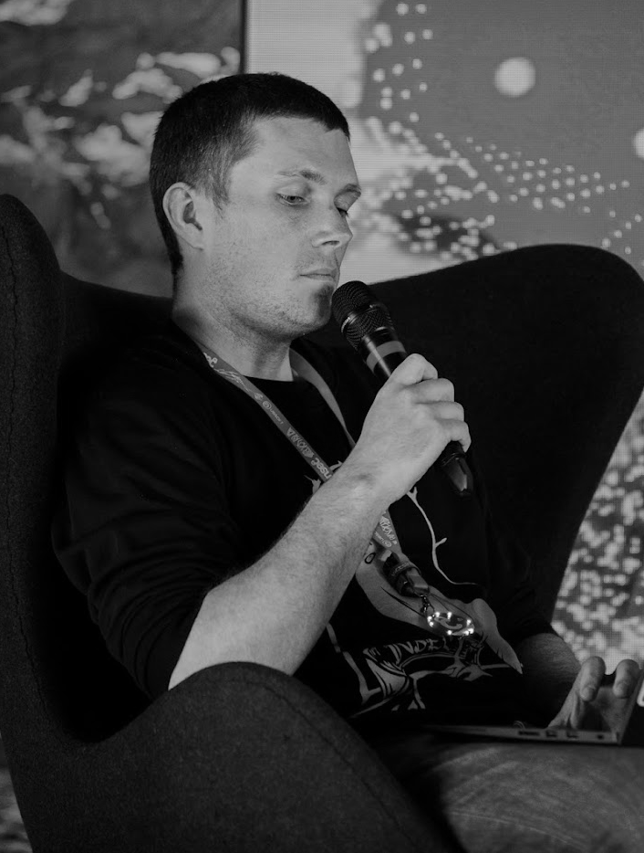
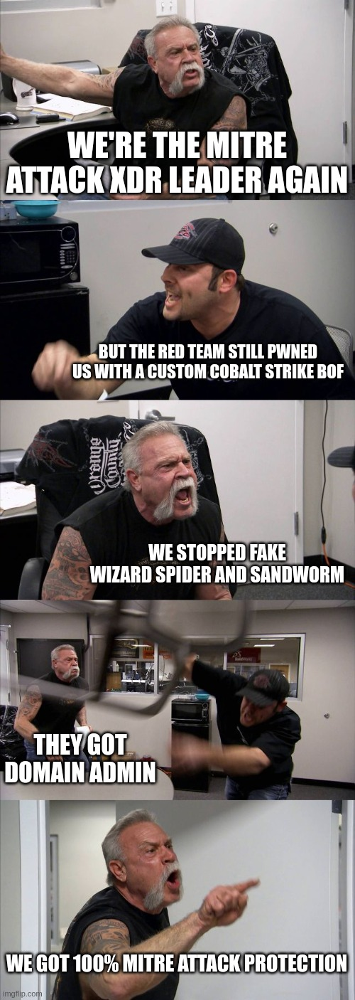
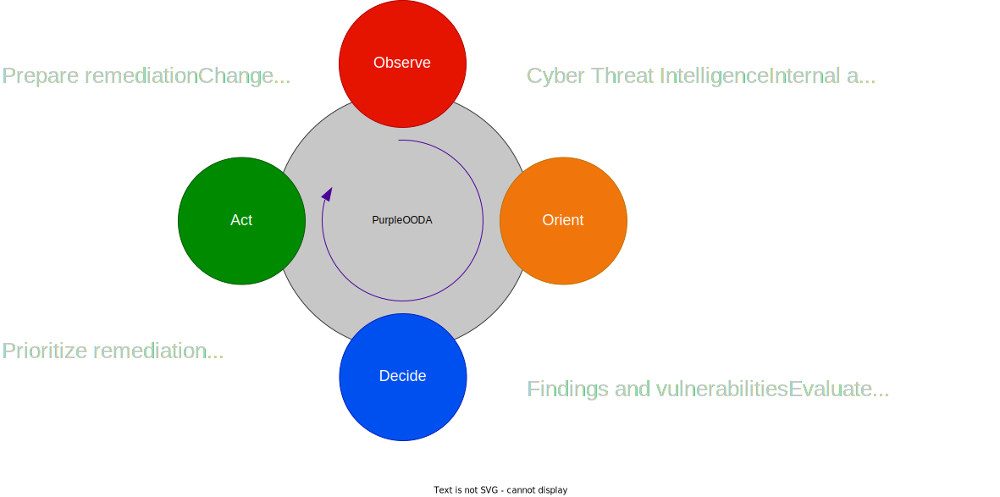
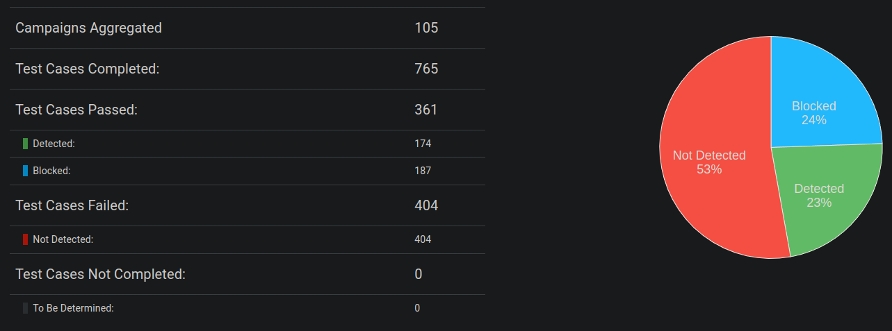
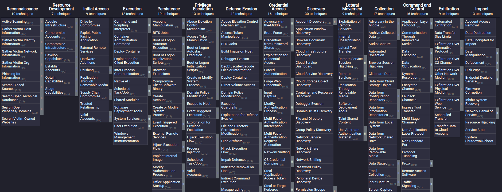
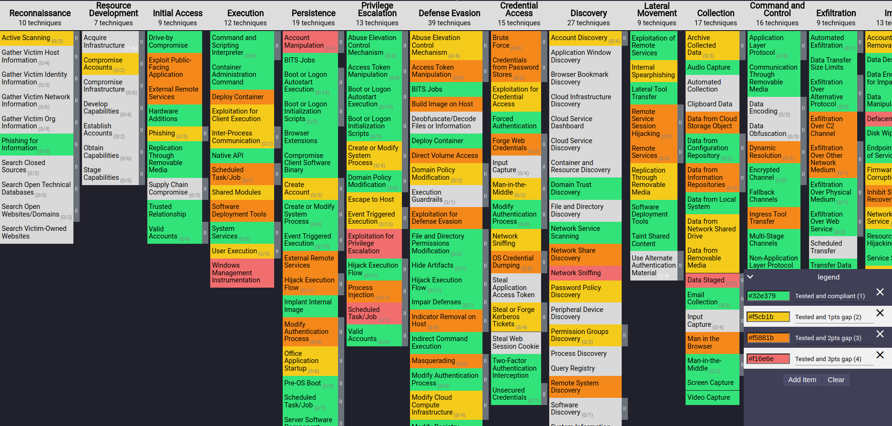
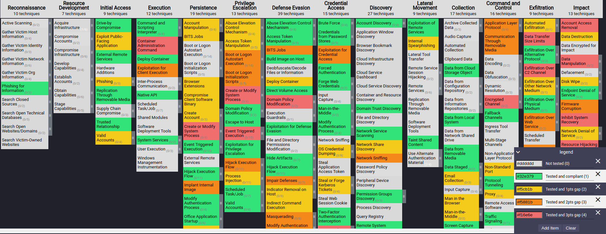
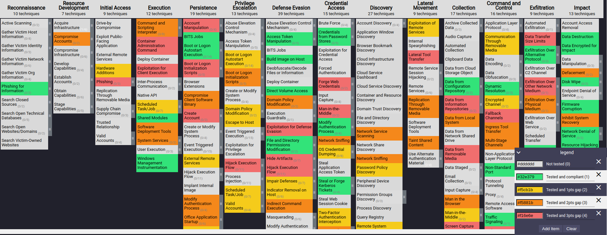

# Purple Team: From Silos to Heroes

## Hackfest 14 - Resurection Edition

###### :calendar: 2022-10-29

---

<!-- _paginate: off -->

# Agenda

- Who we are
- Defining Purple Teaming
- Challenges with the current landscape
- Continuous Purple Teaming
  - Process
  - People
  - Techno
- Building a security posture
- The ultimate goal

 

> TL;DR :heart: + :blue_heart: = :boom: :rocket:

---

<!-- _paginate: off -->

# Bio: Martin Dubé

- Offensive Security Senior Manager :necktie:	
  - Strive to improve Cyber-Security one meeting at a time :date:
  - Pentest, ROP, Red, AppSec, Threat Modeling
- Former HF board member and CTF Team Leader (2010-2015 + 2017)
- Former CTF Designer at NSEC (2018)
- Father of 2 :family_man_woman_boy_boy:, Woodworker :wood:, Runner :runner:
- May be found where there is:
  - Expresso :coffee:
  - Whiskys :tumbler_glass:
  - BBQ :cut_of_meat:

---

<!-- _paginate: off -->

# Bio: Dany Lafrenière

- SOC Senior Manager :necktie:	
- Master at agenda Tetris :jigsaw::date::jigsaw:
- Tierless SOC strong believer :infinity:
- In love with a cat lover :cat::cat::cat:
- I eat chicken wings with a fork :fork_and_knife:
- My favourite superhero is ... Forrest Gump!
---

<!-- _footer: "https://www.youtube.com/watch?v=9_cZ5xn-huc" -->

# Inspiration for this talk

<!--

Notes:
  - Expliquer le talk. Chaque marche offensive a son penchant défensif
  - 1 étape à la fois. Pour apprécier la marche suivante, 
  - Les 3 premières marches: Paradigme de prévention
  - Les 3 dernières marches: Paradigme de détection (Purple)
  - On peut imaginer une 7ième marche: La simulations d'adversaires

-->

---

<!-- _footer: "[^1: https://danielmiessler.com/study/red-blue-purple-teams/](https://danielmiessler.com/study/red-blue-purple-teams/)" -->

# Blue vs Purple vs Red (day-to-day)

Purple is a cooperative mindset between attackers and defenders working on the same side. As such, it should be thought of as a function rather than a dedicated team. [^1](#)

## Blue Team activities

- Goal: Defend
- Require: Autonomy
- Velocity: High
- Analogy: Self-study

## Purple ~~Team~~ activities

- Goal: Improve posture
- Require: Collaboration
- Velocity: High
- Analogy: Group study

## Red Team activities

- Goal: Test resiliency
- Require: Incident (Surprise)
- Velocity: Low
- Analogy: The exam

<!--  

Notes mdube:

- Proposition: Dany compare blue avec purple, ensuite je compare purple avec Red.
- Bien définir la définition de Purple Team

-->

---

<!-- _class: nologo -->

# Challenges with current landscape

The typical project-based testing workflow is limited.

- Priorization is often only based on public data
- CVSS is *so* imperfect
- Reports require unnecessary time to write and consume
  - And they "expire" once delivered (snapshots)
- Reports hardly feed a security posture

*Some* security vendors are very optimistic.

> 100% Mitre Attack Protection :pinched_fingers:	

<!--

Notes mdube:

- 

-->

---

# Challenges with current landscape

- Results are hard to consume
  - Blue team manager's point of view ... TL;DR 
- Recommendations are easy
- Multiples goals and priorities with finite resources
  - ...the never-ending operational backlog and incident response 
  
<!--  -->

---

<!-- _class: separation_page3 -->

# Continuous Purple Teaming

## **Process**, People, Techno

---

<!-- 
This section is the beginning of the conclusion and use the ODDA loop to visualise the end GOAL`

with this in mind it's back to one page with the text in it
-->

# Can Your Purple Team OODA Loop?

---

# How it looks on the field

---

<!-- _class: separation_page3 -->

# Continuous Purple Teaming

## Process, **People**, Techno

---

# Manage your ego

- The foundational importance of trust in relationships
  - Consistency
  - Communication
  - **Time**

&nbsp;

- Messages and actions from management is key
- The grass is always greener on the other side

<!-- mdube notes

- Introduce with Rainbows and unicorns
- Can become competition very quickly

-->

---

# Team or Teams?

What distinguishes a team from a group of people?

- The team has **a common goal**

A purple team is a *virtual* team, even though it is composed of multiple teams.

- One clear goal
- Autonomy
- Mastery

---

<!-- _class: separation_page3 -->

# Continuous Purple Teaming

## Process, People, **Techno**

<!-- 
- Principles
- Tradecraft Intelligence Platform
- Testing Environment
- Results Platform

-->

---

# Principles

## Do

<!-- - Prioritization involves multiple teams -->

- Testing Environment
  - Run in production
  - Share to both teams :heart: :blue_heart:
- Results Platform
  - Centralize results for all teams :heart: :blue_heart: :yellow_heart:
  - APIs

## Don't

- Write reports unless necessary
- Use Microsoft Office
  - Write results in Excel :vomiting_face:
  - Macros are not meant for continuous operations

  

---

## Tradecraft Intelligence Platform

Intelligence Gathering is an everyday task. **Must be as lean as possible!**

Prerequisite:

- Choose a ticketing system :tickets:
- Dev a bot :robot:

Then:
1. Discover attack procedures on twitter
2. Send them to the bot, specify the **Tactic**
3. The bot verify if it already exists
4. Append it to the pile :shit:
5. Prioritize through Backlog Grooming

---

# Testing Environment

- Unit Testing Tools
  - Great to quick start testing and automation
  - Many open source options
  - Can be hard to maintain ...
- Breach and Attack Simulation (BAS)
  - Feeds from up-to-date intel and TTPs 
  - Great to automatically test if the controls or detection are working... or still working
  - Can be used to automate repeatable purple team tests

<!-- mdube notes

- I love to work with a blue team. By making sure they make sure their UC works, Red can focus on raising the bar.

-->

---

# Results Platform - Vectr

---

# Results Platform - Vectr

---

# Results Platform - Vectr

---

# Results Platform - Vectr

---

<!-- _class: separation_page3 -->

# Building a (*living*) security posture

##### What is our next best move?

---

# The quest of building a living security posture

More challenges:

- How do we measure our progression?
- What is the baseline?
- How do we define "good enough"?
- How do we update it in real time?
- :exploding_head: What the hell is a security posture? :dizzy_face:

<!-- mdube notes

- There are many management challenges in the concept of security posture
- Feed multiple teams
  - CISO: For investments
  - Blue: Known unknown vs Unknown unknown

-->

<!--  -->

  

---

<!-- _footer: https://www.techtarget.com/searchsecurity/definition/security-posture -->

# The quest of building a living security posture

A **security posture** is an organization's overall cybersecurity strength and how well it can predict, prevent, detect and respond to ever-changing cyber threats. [^1]()

### MVP

- Must be built from irrefutable data :purple_heart:
- Must fit a single page :newspaper:
- Quantitative over Qualitative
- Indicators with colours :red_circle: :orange_circle:	:yellow_circle:	:green_circle:	
- Support "ever-changing cyber threats" :badger:	
- Must quickly answer where we're **good** and where we're **bad**.

---

<!-- _class: separation_page2 -->

### Solution: Use the Mitre ATT&CK Navigator *with a few hacks*.

---

# ATT&CK Navigator

<!-- mdube notes

- Chaque colone est une tactique
- Chaque cellule est une technique
- Chaque technique peut être exploité de plusieurs façons, ce sont les procédures.

-->

---

# ATT&CK Navigator - Select your Threat Groups

<!-- mdube notes

- Example from Wizard Spider

-->

---

<!-- _paginate: off -->

# ATT&CK Navigator - Technique vs Procedure

- The technique is **what**
- The procedure is **how**
- For example, the technique **Phishing** can executed via:
  - A domain with an invalid DKIM
  - A domain with high reputation
  - A domain with low reputation
  - The organization's domain
  - All kind of attachments
  - Links
  - *At least 100 more procedures...*

<!-- mdube notes

TODO: Find process injections

-->

---

<!-- _footer: "The sophistication level comes from [STIX 2.1](https://docs.oasis-open.org/cti/stix/v2.1/cs01/stix-v2.1-cs01.html#_8jm676xbnggg)" -->
# For each procedure, we will define 3 fields

## Result

The **scored** result of the attack during the purple team exercise.

- Blocked (3)
- Detected (2)
- Logged (1)
- Not Logged (0)

## Expected result

The **scored** expected result of the attack during the purple team exercise.

- Blocked (3)
- Detected (2)
- Logged (1)
- Not Logged (0)

> Need to be realistic, otherwise the posture will just be red...

## Sophistication level

The minimum sophistication level of the Threat Actor.

- Strategic (7)
- Innovator (6)
- Expert (5)
- Advanced (4)
- Intermediate (3)
- Minimal (2)
- None (1)

<!-- mdube notes

- Sophistication example: Creds from memory

-->

---

# Gaps

$$Gap=ExpectedResult-Result$$

 

An example with Phishing technique (T1566):

| Procedure                                                    | Result    | Expected result | Sophistication  |  Gap  |
| ------------------------------------------------------------ | --------- | --------------- | --------------- | :---: |
| Phishing using a domain with an invalid DKIM                 | Logged(1) | Blocked(3)      | Minimal(2)      |   2   |
| Phishing with an excel file hosted on Sharepoint             | Logged(1) | Detected(2)     | Intermediate(3) |   1   |
| Phishing with a signed binary from a compromised third-party | Logged(1) | Logged(1)       | Expert(5)       |   0   |

<!-- mdube notes

- Note that the last TTP would output as "not detected" in Vectr.
 
-->

---

# Weighted Gaps

$$Gap' = Gap * Weight$$

 

We can push it even further by adding a **weight** dimension, which can be as simple as the **popularity of the attack technique** (not procedure). An example with several techniques

| Procedure                                    |  Gap  | Weight | Weighted Gap |
| -------------------------------------------- | :---: | :----: | :----------: |
| Phishing using a domain with an invalid DKIM |   2   |   7    |    **14**    |
| Phishing with a signed binary from a compromised third-party       |   0   |   7    |    **0**     |
| Hardware Additions via a Rubber Ducky        |   2   |   1    |    **2**     |

---

# Add a pinch of CI/CD :pinching_hand:

Every morning:

1. A scheduled job start
2. Data is pulled from Vectr
3. Several JSON files are generated
4. The files are uploaded on a static website

Any time:

- Navigate the navigator :relieved:

---

# Security Posture - Gaps

---

# Security Posture - Weighted Gaps (*Most important*)

---

# Where are our gaps?

Need to be able to answer the question quickly.

From quantitative to qualitative.

Solution: metadata field

How to: **Mouse over**

---

# Security Posture - Gaps - `filter(sophistication=1)`

---

# Security Posture - Gaps - `filter(sophistication=2)`

  

---

# Security Posture - Gaps - `filter(sophistication=3)`

---

<!-- _class: separation_page3 -->

# The ultimate goal

**Improve** the security posture!

---

<!-- # Purple Team Needs to Shortens the OODA Loop ! -->
# The Shortest Loop Wins!

- Can you identify your gaps faster than the attacker?
- Can you adjust faster than your opponent?
- How can you disrupt their OODA Loop?

---

<!--
# Conclusion

- Purple Teaming is about improving the security posture
- OODA Loop: Spin faster than the attacker!
- Purple Team serve one common goal!
- Ego can't be killed. Just manage it.
- The security posture is the #1 ingredient to priorization
- The Mitre ATT&CK Framework is Open Source. Play with it!

---

-->

<!-- _class: separation_page1 -->
<!-- _paginate: false -->

# Thank you! :metal: :pray: :purple_heart:

### We wish you an awesome HF14!

###### And the most important of all: Avoid Excel :laughing:
