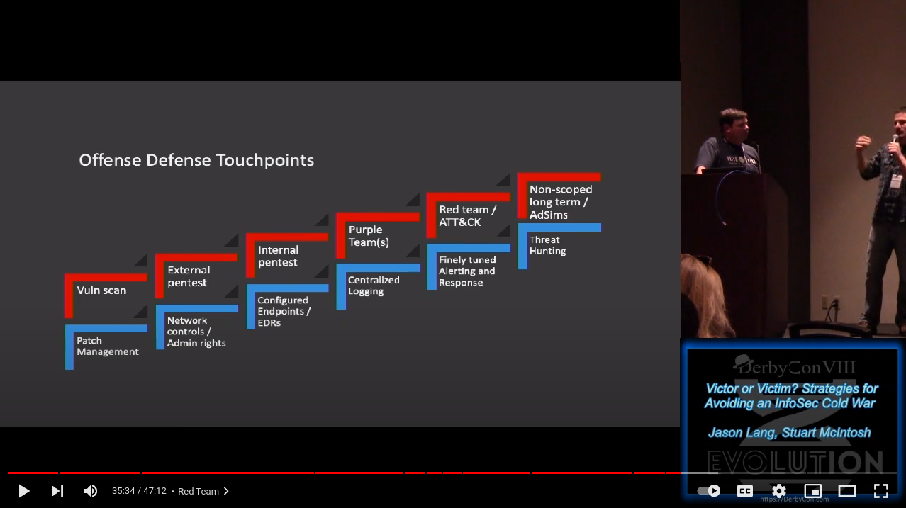
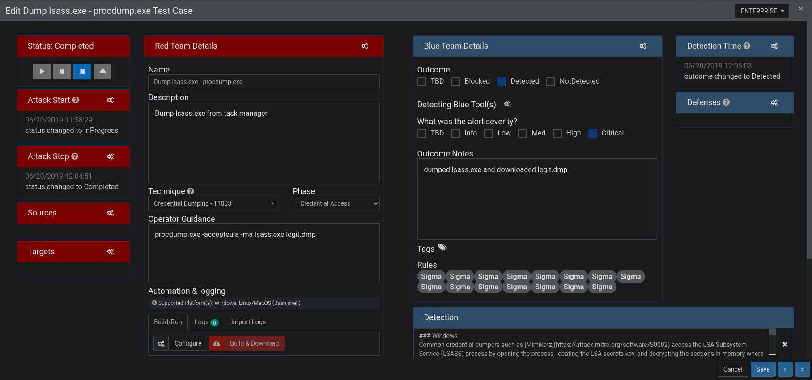

<!-- Optionel: Liens réutilisable -->
[marp-team]: https://github.com/marp-team
[marpit]: https://github.com/marp-team/marpit
[marp-core]: https://github.com/marp-team/marp-core
[marp-cli]: https://github.com/marp-team/marp-cli
[marp-vscode]: https://github.com/marp-team/marp-vscode

# Purple Team: From Silos to Heroes

## Hackfest 14 - Resurection Edition

###### :calendar: 2022-10-29

---

# Agenda

- Who we are
- Defining Purple Teaming
- Challenges with the current landscape
- Continuous Purple Teaming
  - Process
  - People
  - Techno
- Building a security posture
- The ultimate goal

 

> TL;DR :heart: + :blue_heart: = :boom: :rocket:

---

# Bio: Martin Dubé

- Offensive Security Senior Manager :necktie:	
  - Strive to improve Cyber-Security one meeting at a time :date:	
- Former HF board member and  CTF Designer (HF 2010-2016, NSEC 2018)
- Woodworker :wood:
- Father of 2 :family_man_woman_boy_boy:
- Runner :runner:
- May be found where there is:
  - Expresso :coffee:
  - BBQ :cut_of_meat:
  - Whiskys :tumbler_glass:

---

# Bio: Dany Lafrenière (plus foncé)

- SOC Senior Manager :necktie:	
- Master at agenda Tetris :jigsaw::date::jigsaw:
- Tierless SOC strong believer :infinity:
- In love with a cat lover :cat::cat::cat:
- Used to like these but not anymore...
  - Drinking IPA :beer:
  - Eating birthday cake :cake:
  - Presenting at HF with a Red Teamer :heart:
---

<!-- _footer: "https://www.youtube.com/watch?v=9_cZ5xn-huc" -->

# Inspiration for this talk

<!--

Notes:
  - Expliquer le talk. Chaque marche offensive a son penchant défensif
  - 1 étape à la fois. Pour apprécier la marche suivante, 
  - Les 3 premières marches: Paradigme de prévention
  - Les 3 dernières marches: Paradigme de détection (Purple)
  - On peut imaginer une 7ième marche: La simulations d'adversaires

-->

---

# Blue vs Purple vs Red (Exercices)

## Blue Team 

- Process, People, **Techno**
- Goal: Defend
- Require: Autonomy
- Velocity: High
- Analogy: Self-study

## Purple Team

- Process, People, **Techno**
- Goal: Improve posture
- Require: Collaboration
- Velocity: High
- Analogy: Group study

## Red Team

- **Process**, **People**, **Techno**
- Goal: Test resiliency
- Require: Incident (Surprise)
- Velocity: Low
- Analogy: The exam

<!--  

Notes danlaf:
- need coordination and collaboration with Red and Bleu
- Maximized by mixing more junior SOC Analyst with more experience 
  - A great way to see what suspicious activities look like in the environment vs 99.999% of the time looking at false positive
- Time and resources must be freed up

-->

---

<!-- _paginate: false -->
<!-- _class: nologo -->

# Challenges with current landscape

The typical project-based testing workflow is limited.

- The never-ending challenge of prioritization
- Most testing reports are snapshots
- Post-activities are contextual to the selected scope
- Reports require unnecessary time to write and consume
- Cannot feed a security posture (easily)

<!--

Notes mdube:

- 

Notes: danlaf

- TODO: Brainstorn avec mdube sur les limitations 

-->

---

# Challenges with the current landscape

- Results are hard to consume
  - Blue team manager's point of view ... TL;DR 
- Recommendations are easy
- Multiples goals and priorities with finite resources
  - ...the never-ending operational backlog and incident response 
  
<!--  -->

<!--  

Notes danlaf:

- Results are hard to consume
  - Can be very long, too detailed ... I mean please put the findings to fix in a summary at the beginning! 
- Recommendation is easy
  - Often seems that everything is classified Critical or High ... without effort estimates.
  - Does not take into consideration the chain of attack e.i. vs criticality of what is not prevented/detected.
- Multiples goals and priorities with finite resources
  - Hoorey! more backlog on the backlog pile ... !
  -  I’m only the blue… Who said that when the fun is over I am the only one doing the dishes ... we need the Yellow.
- Resources (people) are never enough... the RedTeam must balance the impact ex: an Internal Redteam exercise will impact the availability of the Blue for the Purple activities

-->

---

<!-- _class: separation_page3 -->

# Introducing Continuous Purple Teaming

## Process, People, Techno

---

<!-- _class: separation_page3 -->

# Process

---

<!-- 
This section is the beginning of the conclusion and use the ODDA loop to visualise the end GOAL`

with this in mind it's back to one page with the text in it
-->

# Can Your Purple Team OODA Loop ?

<!-- 
# OODA - Observe

- Cyber Threat Intelligence
- Internal and external environment
- Security posture

---

# OODA - Orient

- Findings and vulnerabilities
  - Evaluate
    - Criticality 
    - Complexity and efforts to remediate
    - Different options and partial remediation (faster to implement)
- Risk assessment
  
---

# OODA - Decide

- Prioritize remediation
  - Planification
  - Funding
  - Deprioritize / Defund prior discoveries or requests

---

# OODA - Act

- Prepare remediation
  - New or adjust control
  - New or adjust detection
- Change management
- Implement in production

-->

<!-- 

Notes danlaf:

Intent for this slide is to set the high level process of the OODA loop for Purple and than in the following slide go in the detail of each steps
  - The utimate goal is to ACT e.i. improvement are une production as fast as possible 
    - "Act" faster than the attackers 

https://en.wikipedia.org/wiki/OODA_loop

"The OODA model was developed by John Boyd, a military strategist and applied to fighter jet operations. Boyd developed the OODA loop model while serving as a fighter pilot in the Korean war and used it to explain the process for achieving success in air-to-air combat."

Prioritize also = Deprioritize / Defund prior discoveries or requests

-->

---

# What it looks on the field

mdube> Je ferais un schéma high level comme celui de Éric mais plus simplifié

---

<!-- _class: separation_page3 -->

# People

---

# Team or Teams?

What distinguishes a team from a group of people?

- The team has **a common goal**

A purple team is a *virtual* team, even though it is composed of multiple teams.

- One common goal
- Autonomy
- Mastery

---

# Manage your ego

- The Foundational Importance of Trust in Relationships
  - Consistency
  - Communication
  - **Time**

&nbsp;

- Messages and actions from management is key
- The grass is always greener on the other side

<!-- 

Notes danlaf:

- 50 shades of purple
  - How much bleue ... how much red?
    - Without the bleue it's not Purple ... even if you try
      - Purple teaming cannot be maximized without bleue involment 
        - Trust building
        - Results will most likely lact context
        - Lower commitment from the bleue to prioritize fixing findings are building improvements
  
  - Were seen and tried many variations
    - Can chnage in time
    - Ajust with the people availability, skills vs the current goal ... or what you have ... MAKE IT WORK!
      - Flexibility is the key
      - Bleue team when you can don't hesitate to mix things up!
        - Great for trainning
        - Help SOC analyst againts alerts fatigue
    - Have social event together ... they need to get to known each other
  
  - Blue and Red DONT think you known what it's like for the other "side"
  
-->

---

<!-- _class: separation_page3 -->

# Techno

- Principles
- Tradecraft Intelligence Platform
- Testing Environment
- Results Platform

---

# Principles

## Do

- Prioritization involves multiple teams
- Tests should be done in production
- Centralize results for all teams :heart: :blue_heart: :yellow_heart:
- Write reports only when necessary
- Share the testing environments :heart: :blue_heart:
- Be Asynchronous
- APIs

## Don't

- Assume automated platforms are enough
  - They are just the beginning
- Use Microsoft Office
  - Write results in Excel :vomiting_face:
  - Macros are not meant for continuous operations

  

---

## Tradecraft Intelligence Platform

Intelligence Gathering is an everyday task. **Must be as lean as possible!**

Prerequisite:

- Choose a ticketing system :tickets:
- Dev a bot :robot:

Then:
1. Discover attack procedures on twitter
2. Send them to the bot, specify the **Tactic**
3. The bot verify if it already exists
4. Append it to the pile :shit:
5. Prioritize through Backlog Grooming

---

# Testing Environment

Whether Automated or Manual, the testing environment **must be** in production.
<!-- 
- Must replicate exactly what is being used in production
  - plutot +the testing environment idealy must be in production environment with nodes/probes equal to what is being used+ 
  - Bref parler de "testing environnement" et ne pas séparer entre "Automated" et "Manual"
  TODO: A bonifier et brainstorm (mdube & danlaf)
-->

- Analytic Testing Tools
  - Great to quick start testing and automation
  - Many open source options
  - Can be hard to maintain ...

<!--  

Notes danlaf:
  - This section needs more research vs BAS
  - Example of these tools
    - **Automated:**
      - Atomic Red Team (Red Canary)
      - RTA by Endgame
    - **Manual more like testing tools:**
      - Metasploits
      - Cobalt Strike

-->

- Breach and Attack Simulation (BAS)
  - Feeds from up-to-date intel and TTPs 
  - Great to automatically test if the controls or detection are working... or still working
  - Can be used to automate repeatable purple team tests

<!--  

Notes danlaf:
  - Keep the test up to date versus "known" IOCs and TTPs
  - Can definitely be used to assist in purple teaming
  - Ability to safely test against malware
  - can remove in part the challenge and limitation of a report/snapshot only "point in time"
  
-->

---

# Results Platform - Vectr

---

# Results Platform - Vectr

---

# Results Platform - Vectr

---

# Results Platform - Vectr

---

<!-- _class: separation_page3 -->

# Building a (*living*) security posture

---

# The quest of building a living security posture

More challenges:

- How do we measure our progression?
- What is the baseline?
- How do we define "good enough"?
- How do we update it in real time?
- :exploding_head: What the hell is a security posture? :dizzy_face:

<!-- mdube notes

- There are many management challenges in the concept of security posture
- Feed multiple teams
  - CISO: For investments
  - Blue: Known unknown vs Unknown unknown

-->

---

# The quest of building a living security posture

A **security posture** is an organization's overall cybersecurity strength and how well it can predict, prevent, detect and respond to ever-changing cyber threats.

### MVP

- Must fit a single page :newspaper:
- Quantitative over Qualitative
- Indicators with colours :red_circle: :orange_circle:	:yellow_circle:	:green_circle:	
- Support "ever-changing cyber threats"
- Must quickly answer where we're **good** and where we're **bad**.

### Solution: Use the Mitre ATT&CK Navigator *with a few hacks*.

---

# ATT&CK Navigator

<!-- mdube notes

- Chaque colone est une tactique
- Chaque cellule est une technique
- Chaque technique peut être exploité de plusieurs façons, ce sont les procédures.

-->

---

# ATT&CK Navigator - Select your Threat Groups

<!-- mdube notes

- Example from Wizard Spider

-->

---

# ATT&CK Navigator - Technique vs Procedure

- A technique is materialized from many possible procedures.
- In this example, the technique **Process Injection** was tested through several procedures.
  - `CreateRemoteThread()`
  - `QueueUserAPC()`
  - ...
  - Injection from different C2s
  - With/Without defence evasion. Ex: `unhook`

Go see **Mr. Un1k0d3r**'s talk for more of ^.

  

<!-- mdube notes

-->

---

# For each procedure, we will define 3 fields

## Result

The **scored** result of the attack during the purple team exercise.

- Blocked (3)
- Detected (2)
- Logged (1)
- Not Logged (0)

## Expected result

The **scored** expected result of the attack during the purple team exercise.

- Blocked (3)
- Detected (2)
- Logged (1)
- Not Logged (0)

> Need to be fair, otherwise the posture will just be red...

## Sophistication level

The minimum sophistication level of the Threat Actor.

- Strategic (7)
- Innovator (6)
- Expert (5)
- Advanced (4)
- Intermediate (3)
- Minimal (2)
- None (1)

<!-- mdube notes

- Sophistication example: Creds from memory

-->

---

# Gaps

We highlight the gap between what was expected and observed.

$$Gap=ExpectedResult-Result$$

An example with Phishing technique (T1566):

| Procedure                                                            | Result     | Expected result | Sophistication   |  Gap  |
| -------------------------------------------------------------------- | ---------- | --------------- | ---------------- | :---: |
| Spearphishing Link  using a domain with an invalid DKIM          | Logged (1) | Blocked (3)     | Minimal (2)      |   2   |
| Spearphishing Link  using an aged domain in the finance category | Logged (1) | Detected (2)    | Intermediate (3) |   1   |
| Spearphishing Link  from employee A to employee B                | Logged (1) | Logged (1)      | None (1)         |   0   |

<!-- mdube notes

- Note that the last TTP would output as "not detected" in Vectr.
 
-->
---

# Weighted Gaps

We can push it even further by adding a **weight** dimension, which can be as simple as the popularity of the attack **technique** (not procedure).

$$Gap' = Gap * Weight$$

An example with several techniques

| Procedure                                                   |  Gap  | Weight | Weighted Gap |
| ----------------------------------------------------------- | :---: | :----: | :----------: |
| Spearphishing Link  using a domain with an invalid DKIM |   2   |   7    |    **14**    |
| Spearphishing Link  from employee A to employee B       |   0   |   7    |    **0**     |
| Hardware Additions via a Rubber Ducky                       |   2   |   1    |    **2**     |

---

# Add a pinch of CI/CD :pinching_hand:

Every morning:

1. A scheduled job start
2. Data is pulled from Vectr
3. Several JSON files are generated
4. The files are uploaded on a static website

Any time:

- Navigate the navigator :relieved:

---

# Gaps View

---

# Weighted Gaps View

---

# What are our gaps?

Need to be able to answer the question quickly.

From quantitative to qualitative.

Solution: metadata field

How to: **Mouse over**

---

# Gaps View - Filter Sophistication=1

---

# Gaps View - Filter Sophistication=2

  

---

# Gaps View - Filter Sophistication=3

---

# Sophistication Graph

Pat?

---

<!-- _class: separation_page3 -->

# The ultimate goal

- Improve the security posture

---

<!-- # Purple Team Needs to Shortens the OODA Loop ! -->
# The Shortest Loop Wins!

<!-- 

Notes danlaf:

  - Full Purple OODA Loop with Attackers OODA Loop around it (e.i. longer loop)
  - Can you adjust faster than your opponent ?
  - How can you disrupt their OODA Loop
    - Prevention / Detection
    - Fix vulnerabilities
    - Deception / Active defence

-->

---

# Conclusion

<!--  Speakers notes 
- Results are hard to consume  (D)
- Recommendation is easy (D)
- Multiples goals and priorities with finite resources (D)
  - Hoorey! more backlog on the backlog pile ... !
  -  I’m only the blue… Who said that when the fun is over I am the only one doing the dishes ... we need the Yellow
-->

- Playing with the ATT&CK Navigator is fun!

---

<!-- _class: separation_page1 -->
<!-- _paginate: false -->

# Thank you! :metal: :pray:

### We wish you an awesome HF14!